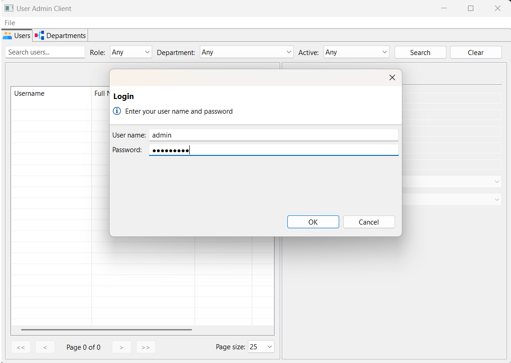
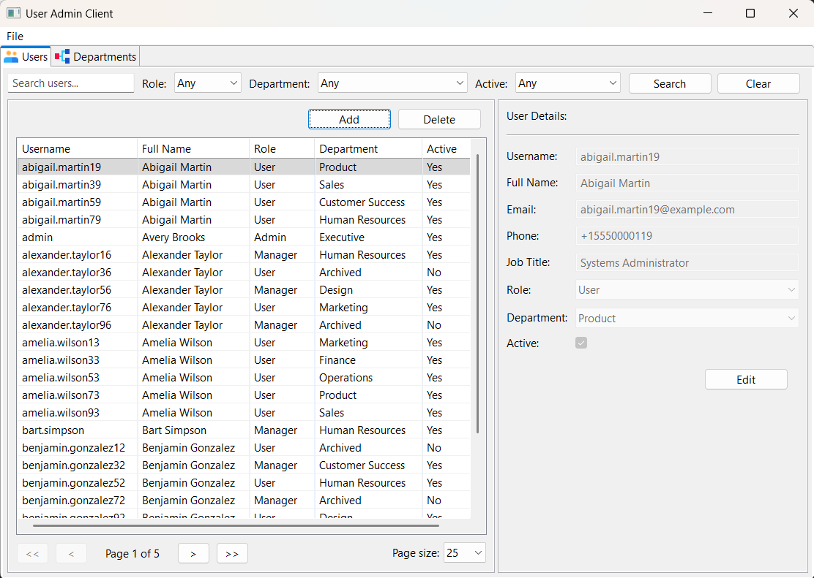
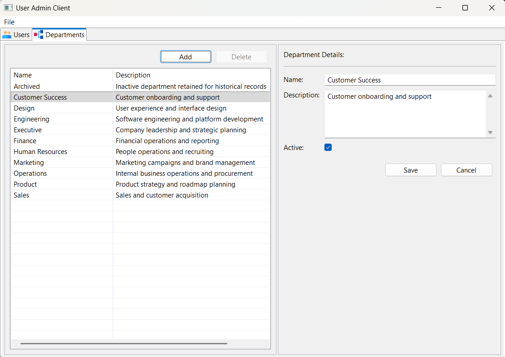

# User Administration System

A Java application for managing users, roles, and departments.

The project consists of:

- Spring Boot REST API
- Eclipse RCP desktop client
- PostgreSQL database
- JWT authentication

The application demonstrates:

- role-based authorization
- department-based restrictions
- business rule enforcement
- paginated REST APIs
- desktop client integration

## Screenshots

### Login



### User Management



### Department Management



## Demo Video

A short walkthrough of login, user management, filtering, paging, and department management:

[Watch the demo video](https://youtu.be/3me7m_lPNX4)

## Downloads

Prebuilt desktop client distributions and demo assets are available in the latest release.

### Version 1.0

[GitHub Release v1.0](https://github.com/kkusylabs/user-admin-system/releases/tag/v1.0)

#### Assets

* [Windows Client](https://github.com/kkusylabs/user-admin-system/releases/download/v1.0/useradmin-win32.win32.x86_64.zip)
* [Mac Client](https://github.com/kkusylabs/user-admin-system/releases/download/v1.0/useradmin-macosx.cocoa.x86_64.tar.gz )
* [Linux Client](https://github.com/kkusylabs/user-admin-system/releases/download/v1.0/useradmin-linux.gtk.x86_64.tar.gz)
* [Demo Video](https://github.com/kkusylabs/user-admin-system/releases/download/v1.0/demo.mp4)
# Architecture

The application follows a layered architecture.

## Backend

### Controllers

HTTP request/response layer.

### Services

Business workflows and orchestration.

Example:

* `UserService`

### Authorization Service

Centralized authorization and capability logic.

Example:

* `UserAuthorizationService`

Responsible for:

* determining allowed actions
* validating permissions
* enforcing business rules
* producing capability objects for the client UI

### Repositories

Persistence using Spring Data JPA.

### DTOs / Mappers

Explicit API contracts and transformations between entities and API models.

### Capabilities-Based API

Responses include capabilities describing what actions the current actor may perform.

Example:

```json
{
  "canEditProfile": true,
  "canEditRole": false,
  "canEditDepartment": false
}
```

This allows the client UI to:

* dynamically enable/disable controls
* avoid duplicating authorization logic
* remain consistent with backend permissions

### PATCH-Style Updates

User updates follow PATCH-style semantics.

* only provided fields are updated
* omitted fields remain unchanged
* validation and authorization are applied per-field

The backend uses `JsonNullable` to distinguish:

* field not provided
* field explicitly set to null

The desktop client builds patches dynamically based on:

* editable capabilities
* actual changed values


## Desktop Client (Eclipse RCP)

The desktop client is built with:

* Eclipse RCP
* SWT
* JFace
* async REST client integration

Features include:

* paginated user table
* filter/search support
* role and department filtering
* UI actions enabled based on user permissions
* inline create/edit workflows
* master-detail layout
* page-size controls
* async loading

The UI follows a composite-oriented structure consisting of:

* Parts
* Composites
* Action interfaces
* API client layer
* UI orchestration layer

The client communicates with the backend exclusively through REST APIs and capability-driven responses.

# Authorization Model

The system defines three roles.

## ADMIN

* Full access to all users and departments
* Can assign any role
* Cannot remove the last active admin

## MANAGER

* Can manage basic users in their own department
* Can only assign the `USER` role
* Must belong to an active department

## USER

* No administrative privileges

# Business Rules

The system enforces several business invariants.

* A user cannot delete their own account
* The system must always have at least one active admin
* Departments must be active to be assigned
* Managers are restricted to their own department
* Role assignment is constrained by actor permissions

These rules are enforced in the service layer rather than only at the API boundary.

# API Overview

## Authentication

### `POST /api/auth/login`

Authenticates a user and returns a JWT.

### `GET /api/auth/me`

Returns the currently authenticated user.

## Users

### `GET /api/users`

Returns a paginated user list with capabilities.

### `GET /api/users/{id}`

Returns a single user.

### `GET /api/users/{id}/edit`

Returns editable fields and allowed options.

### `POST /api/users`

Creates a new user.

### `PATCH /api/users/{id}`

Applies partial updates.

### `DELETE /api/users/{id}`

Deletes a user with invariant safeguards.

## Departments

### `GET /api/departments`

Returns departments with capabilities.

### `GET /api/departments/{id}`

Returns a single department.

### `POST /api/departments`

Creates a department.

### `PUT /api/departments/{id}`

Updates a department.

### `DELETE /api/departments/{id}`

Deletes a department.

# Running the Project

## Requirements

* Java 21+
* Docker

## Running the Backend

### Development Mode

Use this workflow for local backend development.

Starts PostgreSQL with Docker and runs Spring Boot from source.

```bash
cd backend
docker compose -f compose.dev-db.yml up -d
./mvnw spring-boot:run -Dspring-boot.run.profiles=dev
```

### Demo Mode

Run the packaged demo stack:

```bash
cd backend
docker compose up --build
```

### Endpoints

```text
Application: http://localhost:8080
API:         http://localhost:8080/api
Swagger UI:  http://localhost:8080/swagger-ui/index.html
```

### Demo login
```text
username: admin
password: demo12345
```

### Testing

Run all tests:

```bash
cd backend
./mvnw test
```

## Building and Running the RCP Client

The Eclipse RCP client is built separately from the backend.

### Build the Client

From a terminal, go to the RCP master project:

```bash
cd rcp-client/io.github.kkusylabs.useradmin.client.master
./mvnw install
```

This builds the client product for the supported platforms.

### Build Output

After the build completes, the packaged client applications are created under:

```text
rcp-client/io.github.kkusylabs.useradmin.client.product/target/products
```

This directory contains platform-specific distributions such as:

```text
useradmin-linux.gtk.x86_64.tar.gz
useradmin-macosx.cocoa.x86_64.tar.gz
useradmin-win32.win32.x86_64.zip
```

### Run the Client

1. Copy the appropriate archive for your platform to a convenient location.

   Example:

   ```text
   C:\Users\<your-user>
   ```

   or:

   ```text
   /home/<your-user>
   ```

2. Extract the archive.

3. Open the extracted folder.

4. Launch the application:

  * Windows → double-click `useradmin.exe`
  * Linux/macOS → run the useradmin launcher

### Backend Connection

The backend API must be running before using the desktop client.

By default, the RCP client connects to:
```text
http://localhost:8080/api
```
To use a different API endpoint, set either:

**Java System Property**

```bash
-Duseradmin.api.baseUrl=http://localhost:8080/api
```
**Environment Variable**
```bash
USERADMIN_API_BASEURL=http://localhost:8080/api
```

## Using Swagger UI

After starting the backend, open Swagger UI:

```text
http://localhost:8080/swagger-ui/index.html
```

Swagger UI lets you view and test the API endpoints from your browser.

### Log in
1. Open `POST /api/auth/login`
2. Click **Try it out**
3. Enter credentials:
   ```json
   {
      "username": "admin",
      "password": "demo12345"
   }
   ```
4. Click **Execute**
5. Copy the `accessToken` from the response

### Authorize request
1. Click **Authorize** near the top of the page
2. Paste the `accessToken` in the Value text field
3. Click **Authorize**
4. Close the dialog

You can now call protected endpoints from Swagger UI.

### Verify authentication

Open `GET /api/auth/me` and click **Execute**

If Authorization is working, it returns the currently authenticated user

### Example workflow

1. Log in
2. Authorize using your token
3. Call `GET /api/departments` to view departments
4. Call `POST /api/departments` (admin only) to create one

# Future Enhancements

* Improved client-side error handling and more user-friendly validation and API error messages
* Password management workflows
  * administrator password reset support
  * authenticated user password change support
* Inline field validation feedback
* Advanced table sorting
* Additional automated UI testing

# Acknowlegements

* Icons provided by Icons8  
  https://icons8.com

# Author

Kevin Kusy

GitHub:

```text
https://github.com/kkusylabs
```
